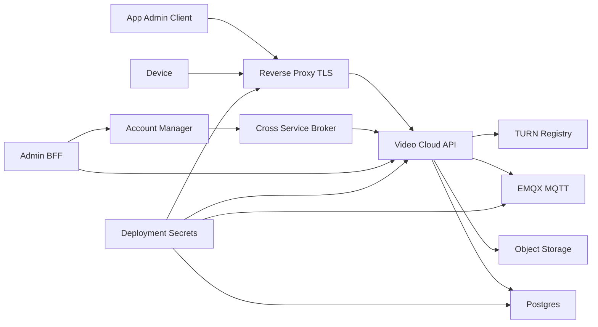

# RTK Video Cloud STRIDE Threat Model

## Executive Summary

The highest-risk themes are identity and subject-binding failures across
device/app/admin routes, leakage of deployment or runtime secrets, and
availability pressure on WebRTC, MQTT, storage, and database-backed runtime
surfaces. The most sensitive boundaries are device mTLS/token issuance, legacy
compatibility auth paths, media download access, cross-service lifecycle
commands, and deployment secret handling. This first version is grounded in the
pinned workspace documents and marks deployment-dependent conclusions as
assumptions.

## Scope And Assumptions

In scope:

- `repos/rtk_video_cloud` runtime and deployment boundaries.
- Private-cloud runtime dependencies documented by the workspace: reverse
  proxy/TLS, PostgreSQL, object storage, EMQX/MQTT, TURN registry,
  cross-service broker, observability, and deployment secrets.
- Adjacent Account Manager and Admin BFF behavior only where it crosses a Video
  Cloud trust boundary.

Out of scope:

- Full source review of `rtk_account_manager`, `rtk_cloud_admin`,
  `rtk_cloud_frontend`, and `rtk_cloud_client`.
- Customer-specific infrastructure that is not represented in this pinned
  workspace snapshot.
- CI-only issues unless they affect runtime deployment secrets, release
  artifacts, or evidence packages.

Key assumptions:

- Production-like deployments terminate TLS at a reverse proxy or load balancer
  before routing to selected public service surfaces.
- Raw service ports, PostgreSQL, NATS JetStream, Prometheus metrics, and EMQX
  dashboard are private or authenticated admin surfaces.
- Device mTLS is the intended production device-authentication model, while
  some legacy compatibility flows may still exist during migration.
- Media, snapshots, firmware, device identity, tenant ownership, provisioning
  state, and service-option ACLs are security-sensitive.
- Risk ranking may change when the target deployment profile and enabled
  compatibility paths are confirmed.

Open questions:

- Is the target deployment single-node evaluation, production-like private
  cloud, or Linode staging?
- Is device mTLS required on production device-facing endpoints today?
- Which legacy token, certificate-header, subscriber, or query-token
  compatibility paths remain enabled?
- Are MQTT, TURN registry APIs, metrics, EMQX dashboard, NATS, or raw service
  ports reachable outside the private network?

## Evidence Anchors

| Claim | Evidence |
| --- | --- |
| Video Cloud provides HTTP, WebSocket, WebRTC signaling, TURN registry control-plane support, PostgreSQL runtime state, local/S3 object storage, and deployment artifacts. | `repos/rtk_video_cloud/README.md` |
| Production-like private cloud requires reverse proxy/TLS, Postgres, object storage, EMQX when MQTT is enabled, broker support when cross-service channel is enabled, secrets management, and observability. | `docs/private-cloud-deployment.md` |
| Production guidance keeps metrics, EMQX dashboard, PostgreSQL, and NATS private or authenticated. | `docs/private-cloud-deployment.md` |
| Required secret categories include DSNs, JWT/auth signing secrets, MQTT credentials, cloud credentials, object storage keys, deploy keys, and private clip/certificate assets. | `docs/private-cloud-deployment.md`, `docs/deployment-secrets-governance.md` |
| Account Manager is authoritative for identity, tenant context, authorization, entitlement, device registry, and provisioning intent. | `docs/account-manager-admin-boundary.md` |
| Admin dashboard/BFF state is non-authoritative when upstream services are configured. | `docs/account-manager-admin-boundary.md` |
| Device mTLS can derive canonical device identity and reject body `devid` conflicts; token issuance must remain subject-bound. | `repos/rtk_cloud_contracts_doc/AUTH.md` |
| Factory certificate issuance is separate from normal token refresh and CSR alone is not authentication. | `repos/rtk_cloud_contracts_doc/PROVISION.md` |
| WebRTC stream routes use bearer auth and have app/admin/device route-specific scope rules. | `repos/rtk_cloud_contracts_doc/STREAMING.md` |
| TURN registry v1 uses shared-key HMAC headers and the signing key must not be exposed to apps, devices, SDK validation artifacts, or logs. | `repos/rtk_cloud_contracts_doc/STREAMING.md` |

## System Model

### Primary Components

- App/Admin clients call public API and WebRTC signaling surfaces through a
  reverse proxy/TLS boundary.
- Devices authenticate with mTLS or scoped tokens and use device API,
  WebSocket/WSS, MQTT, media upload, and WebRTC answer surfaces.
- Video Cloud API coordinates tokens, activation, media, firmware, device
  transport, streaming, and runtime state.
- Account Manager owns tenant, authorization, registry, entitlement, and
  provisioning intent.
- Admin BFF proxies or aggregates upstream Account Manager and Video Cloud
  facts for operator workflows, but is not authoritative for canonical state.
- PostgreSQL stores runtime state and metadata.
- Object storage stores media, snapshots, and firmware artifacts.
- EMQX/MQTT and WebSocket carry device transport messages.
- TURN registry and TURN nodes support WebRTC ICE server selection and relay
  capacity.
- Deployment pipeline/operator systems inject secrets, install release
  artifacts, and configure runtime boundaries.

### Data Flows And Trust Boundaries

- Internet app/admin clients -> reverse proxy/TLS -> Video Cloud API:
  bearer tokens, WebRTC offers, media requests, and admin/device commands cross
  over HTTPS/WSS. Security depends on TLS termination, route-specific bearer
  authorization, subject binding, request limits, and logging redaction.
- Device -> mTLS/token issuance -> device-scoped APIs/WebSocket/MQTT:
  device certificates, derived `devid`, access/refresh tokens, telemetry,
  media, and SDP answers cross device-facing channels. Security depends on
  certificate validation, revocation, token subject binding, broker auth, and
  compatibility-flow controls.
- Account Manager/Admin BFF -> Video Cloud protected APIs:
  admin bearer tokens, tenant/device lifecycle commands, provisioning state, and
  cache/proxy reads cross service boundaries. Security depends on upstream
  Account Manager authority, admin-token protection, idempotent lifecycle
  commands, and fail-closed BFF behavior.
- Video Cloud -> Postgres/object storage/EMQX/TURN registry:
  runtime state, media, firmware, broker messages, TURN node data, and shared
  secrets cross infrastructure boundaries. Security depends on private network
  access, least-privilege credentials, object integrity, HMAC for TURN registry,
  and operational monitoring.
- Deployment pipeline/operator -> env files/secrets/release artifacts:
  DSNs, JWT secrets, MQTT credentials, object storage keys, deploy keys, private
  certificate assets, and release bundles cross deployment boundaries. Security
  depends on secret managers, root-owned env files, GitHub Environment secrets,
  artifact integrity, redaction, and rotation.

#### Diagram

## Assets And Security Objectives

| Asset | Why it matters |
| --- | --- |
| JWT/auth signing secrets and refresh tokens | Compromise enables impersonation and persistent unauthorized access. |
| Device certificates and device-derived identity | Compromise enables device spoofing, token recovery, and cross-device abuse. |
| Tenant/org/device ownership and service-option ACL state | Integrity-critical for authorization, provisioning, and cross-tenant isolation. |
| Media clips, snapshots, and firmware blobs | Confidentiality and integrity impact customer privacy and device safety. |
| PostgreSQL runtime/account projections | Integrity and availability affect activation, state, metadata, and auditability. |
| MQTT credentials and broker state | Compromise enables transport spoofing, command/event manipulation, or DoS. |
| TURN registry HMAC keys and TURN shared secrets | Compromise enables relay abuse and manipulation of WebRTC connection data. |
| Deployment secrets and release artifacts | Compromise enables full service takeover or persistent supply-chain tampering. |
| Audit logs, metrics, and readiness evidence | Required to investigate sensitive actions and prove operational state. |

## Attacker Model

Capabilities:

- Remote internet attacker can send unauthenticated or malformed traffic to any
  public endpoint exposed by the deployment.
- Authenticated low-privilege app or user can attempt cross-device,
  cross-tenant, or over-scoped operations.
- Compromised device or copied device credential can attempt token recovery,
  MQTT/WebSocket identity spoofing, media upload/download, or WebRTC signaling
  abuse.
- Operator or deployment mistake can expose raw ports, metrics, dashboards,
  broker listeners, or secret-bearing artifacts.

Non-capabilities:

- Attacker is not assumed to have host root access, direct private-network
  database access, or valid production secret-manager access unless a separate
  deployment leak occurs.
- Attacker is not assumed to control Account Manager authoritative state unless
  cross-service auth, broker, or admin-token protections fail.
- Attacker is not assumed to break TLS cryptography; risk focuses on
  configuration, authorization, subject binding, compatibility, and secret
  handling failures.

## STRIDE Risk Summary

| ID | STRIDE | Threat | Priority |
| --- | --- | --- | --- |
| S1 | Spoofing | Token, legacy credential, or certificate-header reuse impersonates a device or app. | High |
| S2 | Spoofing | Weak MQTT auth or exposure lets a client spoof device transport identity. | High |
| T1 | Tampering | Cross-service lifecycle command or activation state is modified, replayed, or duplicated. | High |
| T2 | Tampering | Media, firmware, or release artifacts are modified in storage or deployment paths. | Medium |
| R1 | Repudiation | Sensitive issuance, provisioning, media, or proxy actions lack reliable audit evidence. | Medium |
| I1 | Information Disclosure | Media/download tokens, compatibility scopes, query tokens, or logs leak clips or snapshots. | High |
| I2 | Information Disclosure | Deployment secrets leak through git, logs, artifacts, issue bodies, or evidence packages. | Critical |
| D1 | Denial of Service | WebRTC, MQTT, media, DB, TURN, or storage resources are exhausted. | High |
| D2 | Denial of Service | Private control-plane surfaces are exposed and abused. | Medium |
| E1 | Elevation of Privilege | Scope confusion lets non-admin credentials perform admin or cross-device actions. | High |
| E2 | Elevation of Privilege | Admin BFF proxy/cache expands privileges beyond upstream authority. | High |

Detailed STRIDE rows are maintained in `../analysis/stride-matrix.md`.

## High And Critical Threats

### I2: Deployment Secret Disclosure

Likelihood: Medium. The workspace has multiple deployment channels, local env
files, release artifacts, evidence collectors, and operator-owned secret
storage patterns, so accidental disclosure is realistic without automation.

Impact: Critical. Leaked signing keys, DSNs, MQTT credentials, deploy keys,
object storage keys, or private certificate material can enable full service or
data compromise.

Existing mitigations: Workspace and private-cloud docs forbid putting deploy
secrets in docs, source, issue bodies, logs, or public workflow logs, and define
accepted storage patterns.

Gaps: The initial threat model has not verified that all generated evidence,
release bundles, logs, and security artifacts are covered by scanning and
redaction checks.

Recommendations:

- Run secret scanning on commits, release artifacts, evidence packages, and
  `cyber_security/` outputs.
- Keep env files ignored and root-owned in deployed hosts.
- Store only redacted command summaries in security reports.
- Rotate any secret version that appears in git, logs, CI output, or shared
  evidence.

Detection:

- Alert on secret-scan findings and public artifact changes.
- Monitor unexpected use of old secret versions or credentials from unusual
  hosts.

### S1/E1: Token, Subject-Binding, And Scope Confusion

Likelihood: Medium. The auth contract documents modern bearer auth, mTLS
device identity, route-specific scopes, and remaining legacy compatibility
paths, which creates a realistic review target.

Impact: High. A successful bypass can grant cross-device media access, device
command execution, unauthorized WebRTC sessions, or admin-only actions.

Existing mitigations: Route scope matrices, subject-binding rules, mTLS-derived
device identity, and `devid` conflict rejection are documented.

Gaps: Implementation must be reviewed to confirm every compatibility route,
download route, WebSocket/MQTT path, and WebRTC route enforces the same
subject-binding and deny-by-default policy.

Recommendations:

- Centralize route authorization policy where feasible.
- Add table-driven tests for every route family, accepted scope, rejected
  scope, subject mismatch, legacy alias, and cert/body identity conflict.
- Disable legacy certificate-header and query-token compatibility in
  production once migration allows.

Detection:

- Alert on repeated subject mismatch, legacy-route auth failures, and non-admin
  credentials hitting admin routes.

### D1: Runtime Resource Exhaustion

Likelihood: Medium. WebRTC create/answer flows, device transport ownership,
TURN capacity, media upload/download, Postgres, object storage, and MQTT broker
resources are all externally influenced when exposed.

Impact: High. Exhaustion can interrupt camera streaming, provisioning,
transport, media access, and operational monitoring.

Existing mitigations: Streaming contract defines expiry, timeout, session
lifecycle, and resource-limit style errors.

Gaps: Edge rate limits, request size limits, per-device session caps, TURN
capacity checks, and broker limits need deployment and implementation
verification.

Recommendations:

- Enforce reverse-proxy and app-level rate limits.
- Cap SDP/body size, pending WebRTC sessions, per-device concurrency, and media
  upload size.
- Add timeout cleanup and quota-aware TURN node selection.
- Keep metrics private or authenticated and alert on saturation.

Detection:

- Track spikes in 408/409 responses, pending session counts, TURN capacity,
  broker queue depth, storage growth, and DB connection pool saturation.

### T1: Cross-Service Lifecycle Tampering

Likelihood: Medium. Provisioning spans Account Manager, cross-service channel,
Video Cloud, device activation, service-option ACLs, and retries.

Impact: High. Tampering can grant wrong service access, activate the wrong
device, disable a legitimate device, or corrupt tenant ownership state.

Existing mitigations: Provisioning contract requires operation ids, canonical
service options, command/event evidence, retry/dead-letter state, and failure
semantics.

Gaps: Need implementation review for message authentication, replay rejection,
idempotency, and conflicting duplicate operation handling.

Recommendations:

- Authenticate cross-service messages and admin API callers.
- Enforce idempotency keys and reject duplicate operation ids with conflicting
  payloads.
- Audit before/after lifecycle state with tenant, device, operation id, and
  actor.

Detection:

- Alert on conflicting duplicate operation ids, dead-letter spikes, state
  divergence between Account Manager and Video Cloud, and unexpected
  deactivation bursts.

### E2: Admin BFF Privilege Expansion

Likelihood: Medium. The Admin BFF aggregates and caches upstream facts, which
can become dangerous if local state is treated as authoritative for mutating
operations.

Impact: High. A proxy/cache auth bug can allow tenant, device, provisioning,
stream, or lifecycle operations without upstream authority.

Existing mitigations: Workspace boundary docs explicitly say Admin BFF is not
authoritative for canonical account, org, device, provisioning, or video runtime
state.

Gaps: Need production-mode implementation review for stale/unauthorized/partial
upstream failures and local console state.

Recommendations:

- Require upstream authorization for mutating operations.
- Fail closed when upstream auth fails or source facts are stale/partial.
- Label cache-only views as non-authoritative and keep local sessions separate
  from upstream identity.

Detection:

- Monitor BFF mutations that lack upstream authorization evidence or use stale
  cache as decision input.

## Mitigation Backlog

| Priority | Work item |
| --- | --- |
| Critical | Add or enforce secret scanning across commits, artifacts, evidence packages, and `cyber_security/` outputs. |
| High | Build table-driven authorization tests for route family, scope, subject, legacy alias, and token/cert conflict coverage. |
| High | Add deployment preflight checks for public listener drift on metrics, EMQX dashboard, Postgres, NATS, and raw service ports. |
| High | Verify MQTT auth/TLS policy and per-device identity binding in EMQX deployment assets. |
| High | Verify WebRTC/session limits, request body limits, timeout cleanup, and TURN capacity controls. |
| High | Verify cross-service command authentication, idempotency, and replay/conflict rejection. |
| Medium | Standardize audit fields and correlation ids across token issuance, certificate issuance, provisioning, media access, and admin proxy actions. |
| Medium | Add checksum/signature checks for firmware and release bundles where not already enforced. |

## Manual Security Review Focus Paths

| Path | Reason |
| --- | --- |
| `repos/rtk_video_cloud/internal/httpapi` | Route registration, auth middleware, compatibility adapters, subject binding, and media/download surfaces. |
| `repos/rtk_video_cloud/internal/workflow` | API-facing orchestration for activation, streaming, token issuance, and state transitions. |
| `repos/rtk_video_cloud/internal/device` | Device identity, activation state, transport ownership, and service-option enforcement. |
| `repos/rtk_video_cloud/internal/stream` | WebRTC session lifecycle, concurrency, timeout, and SDP handling. |
| `repos/rtk_video_cloud/internal/postgres` | Persistence boundaries, transaction consistency, and DSN handling. |
| `repos/rtk_video_cloud/internal/blob` | Media, snapshot, and firmware object authorization and storage path behavior. |
| `repos/rtk_video_cloud/deploy` | Environment examples, systemd units, EMQX compose, listener exposure, and secret handling. |
| `repos/rtk_cloud_admin` | BFF proxy authorization and non-authoritative cache behavior. |
| `repos/rtk_account_manager` | Authoritative tenant/device registry, provisioning intent, and cross-service command publication. |

## Quality Check

- Entry points covered: public HTTPS API, WebSocket/WSS, MQTT, WebRTC signaling,
  media download/upload, factory/cert issuance, Admin BFF proxying, deployment
  secrets, release artifacts, and metrics/control-plane surfaces.
- Each trust boundary has at least one STRIDE row in
  `../analysis/stride-matrix.md`.
- Runtime behavior is separated from CI/build/dev tooling; deployment artifacts
  are included only when they affect runtime security.
- User context gaps are recorded in `../assumptions.md` and in this report's
  open questions.
- No raw secrets are intentionally stored in this report.

