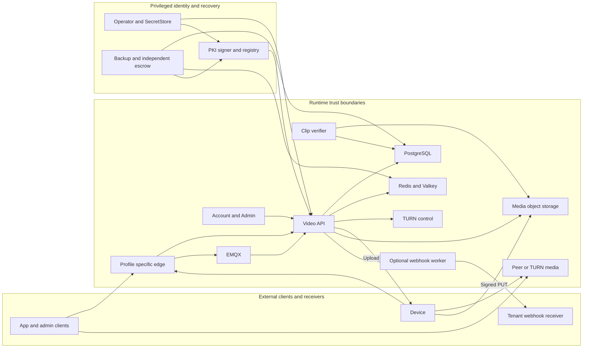

# RTK Video Cloud STRIDE Threat Model

Status: draft; repository-grounded analysis pending environment qualification.

Classification: supporting-note; does not replace canonical contracts.

Owner: rtk_cloud_workspace; control validation belongs to the relevant service owners.

Last reviewed: 2026-10-05.

Applies to: the current Video Cloud checkout and its adjoining trust boundaries,
not a complete RTK Cloud platform assessment or a live security sign-off.

## Executive Summary

The highest-priority review areas are authorization after entitlement or
certificate changes, PKI domain and product binding, MQTT tenant and topic
isolation, and the movement of media and event data across storage and external
receiver boundaries. Deployment credentials and restoration of old security
state can affect all of these controls. The existing STRIDE IDs are retained;
S3, E3, T3, I3, and T4 add previously missing scenarios.

This revision removes the retired account/video broker from the runtime model,
distinguishes LKE TCP passthrough from TLS verification, and records implemented
controls alongside their remaining verification needs. Threats below are abuse
hypotheses, not confirmed exploitable vulnerabilities. Priorities and closure
criteria are maintained in the [STRIDE matrix](../analysis/stride-matrix.md).

## Scope And Assumptions

In scope:

- `repos/rtk_video_cloud` API, device transport, WebRTC signaling and TURN
  admission, media storage, Shadow, optional brand webhook delivery, and
  relevant workers.
- Account Manager, Admin BFF, PKI, PostgreSQL, Redis/Valkey, EMQX, object
  storage, edge networking, deployment identity, and recovery where they cross
  a Video Cloud trust boundary.
- CI/build/release and operator activity when it can change runtime code,
  credentials, trust, artifacts, or retained security evidence.

Out of scope:

- Full source reviews of adjacent repositories, customer-specific networks,
  mobile/firmware internals, and unrelated CI tooling.
- Claims about enabled flags, public exposure, or passing security controls in
  dev, staging, or production without dated evidence for that environment.

The user confirmed this repository scope. No particular live environment was
selected. Private media and integrity-sensitive ownership/entitlement state
are assumed; the attacker is not assumed to possess host root or platform
signing authority at the outset. The [assumptions register](../assumptions.md)
records profile conditions and questions that can change risk ranking.

Reviewed source snapshot:

| Repository | Commit |
| --- | --- |
| Workspace | `82d6643695b6ccdd8156aa560f725b3a543045be` |
| Video Cloud | `ce53d62b50a3cec92145a99435fd79a52ae2ffd0` |
| Contracts | `6b8ef16c197cd295b5ce4aa9f23f0f6d215d9e28` |

These identify the input review snapshot; later documentation commits do not
imply that service code or deployments have changed.

## Evidence Anchors

Evidence levels are deliberately separate:

| Level | Meaning | Limit |
| --- | --- | --- |
| D | Documented contract, design, or policy | Preserve the source's status; a proposed design is not deployed behavior. |
| I | Implementation inspected at the recorded snapshot | A reachable code path may still depend on flags, wiring, or deployment profile. |
| T | Test source inspected | Test existence is not an executed or passing result. |
| E | Dated environment execution evidence | Must identify environment, version, configuration, result, and limitations. None was collected for this review. |

The [source index](../sources.md) supplies current clickable evidence. Important
anchors for this revision are:

| Claim | Evidence and level |
| --- | --- |
| Account/video coordination uses explicit APIs and producer-owned outbox/retry where needed; the standalone gateway is retired. | D: [workspace decision](../../docs/cross-service-broker-packaging.md), [current coordination contract](../../repos/rtk_cloud_contracts_doc/cross_service_channel.md). |
| LKE's external HAProxy forwards TCP; TLS, mTLS, and application authentication remain inside Kubernetes. | D: [LKE edge contract](../../docs/lke-external-haproxy-edge.md). Historical evidence in that document is not today's environment verification. |
| Core API routes remain the default; optional service cutouts and authenticated cutover have separate readiness limits. | D: [Video Cloud architecture](../../repos/rtk_video_cloud/docs/architecture.md), [optional services](../../repos/rtk_video_cloud/docs/optional-services.md). |
| Signed-token reissue retains service options and revision claims. | D: [auth contract](../../repos/rtk_cloud_contracts_doc/auth.md); I: `Service.Refresh` in [auth.go](../../repos/rtk_video_cloud/internal/auth/auth.go). |
| Product PKI checks authoritative device/product/environment binding; the non-Product compatibility branch can accept trusted certificate headers when enabled. | I: [PKI verification](../../repos/rtk_video_cloud/internal/pki/verification.go), `clientCertificateDeviceID` in [router.go](../../repos/rtk_video_cloud/internal/httpapi/router.go); T: [Product PKI tests](../../repos/rtk_video_cloud/internal/httpapi/product_pki_test.go), [mTLS tests](../../repos/rtk_video_cloud/internal/httpapi/mtls_test.go). |
| MQTT authentication binds signed identity to broker input and constructs topic ACLs; strict entitlement mode also rechecks legacy device tokens. | I: [mqtt_auth.go](../../repos/rtk_video_cloud/internal/httpapi/mqtt_auth.go); T: [MQTT auth tests](../../repos/rtk_video_cloud/internal/httpapi/mqtt_auth_test.go). |
| Direct uploads require verifier-owned readiness and current activation epoch. | D: [media contract](../../repos/rtk_cloud_contracts_doc/snapshot_and_media.md); I: [clipupload.go](../../repos/rtk_video_cloud/internal/clipupload/clipupload.go); T: [upload tests](../../repos/rtk_video_cloud/internal/clipupload/clipupload_test.go). |
| The optional brand webhook uses a public-IP-pinned outbound client with redirects and proxying disabled. | I: [API wiring](../../repos/rtk_video_cloud/internal/apiapp/app.go), [worker construction](../../repos/rtk_video_cloud/internal/brandwebhook/worker.go), [transport](../../repos/rtk_video_cloud/internal/brandwebhook/transport.go). |
| Restore must reconcile security changes after the backup point before reopening access. | D: [Core Backup and Restore](../../docs/backup-restore.md); operator attestations require supporting evidence. |

## System Model

### Primary Components

- Core API provides bootstrap, device/app/admin routes, WebSocket, media
  authorization, signaling, and internal coordination. Optional MQTT foundation,
  Shadow, WebRTC, and video-storage processes have distinct identities and
  cutover flags; represent them as enabled only for a selected profile.
- Account Manager supplies authoritative identity, tenant/device ownership and
  grants. Admin BFF forwards or aggregates upstream facts; its cache does not
  authorize mutations independently.
- PKI issuer/signer, registry, revocation state, and trust bundles govern Device,
  App, and Internal Service identities. The Platform PKI contract is a proposed
  normative design; only specifically inspected controls are marked I.
- PostgreSQL stores authoritative runtime and workflow records. Redis/Valkey
  has distinct durable Shadow/outbox, authorization projection, and transient
  signaling/cache/lease roles; their authority and recovery behavior differ.
- EMQX transports device MQTT traffic. TURN registry/control handles admission;
  coturn and peer connections carry media. API signaling state is not the media
  connection itself.
- Media storage and the clip verifier enforce direct-upload readiness. OTA,
  releases, and backup storage have separate credential/purpose boundaries.
  A key prefix alone does not isolate credentials.
- Optional brand webhook workers deliver tenant routing metadata to external
  receivers. Legacy notifiers remain separate paths and do not inherit the
  brand webhook transport's security properties automatically.
- Operators and deployment tooling control SecretStore values, Kubernetes
  copies, releases, issuer authority, backup selection, and recovery gates.

Sources: [architecture](../../repos/rtk_video_cloud/docs/architecture.md),
[Account/Admin boundary](../../docs/account-manager-admin-boundary.md),
[PKI design](../../repos/rtk_cloud_contracts_doc/platform_pki.md),
[storage policy](../../docs/object-storage-policy.md), and
[secret ownership](../../docs/deployment-secrets-governance.md).

### Data Flows And Trust Boundaries

Boundary IDs TB1–TB5 retain their original purposes with corrected detail;
TB6–TB9 make previously implicit edges explicit.

| ID | Edge and data | Channel and required guarantees |
| --- | --- | --- |
| TB1 | Internet -> profile-specific edge -> API: tokens, certificates, SDP, HTTP bodies | HTTPS/WSS; identify the actual TLS verifier, route allowlist, body/rate limits, and raw-port reachability. LKE HAProxy is L4 TCP passthrough through private NodePorts, not a certificate-authentication authority. |
| TB2 | Device/App bootstrap -> runtime authorization: certificate identity, bearer claims, device subject and grant revision | Verified TLS at bootstrap, then bearer/subject ACLs on HTTP/WS/MQTT. Certificate possession, tenant membership, and device authorization are distinct checks. |
| TB3 | Account/Admin -> explicit Video service APIs and projections: lifecycle intent, tenant/device IDs, operation/revision state | Authenticated service API with receiver authorization; producer-owned outbox/lease where applicable. Require conflict/idempotency semantics and fail-closed authoritative reads. |
| TB4 | Video -> PostgreSQL, Redis/Valkey, EMQX, TURN control, and storage: state, commands, credentials, session data | SQL, Redis, MQTT, authenticated control HTTP and S3/local I/O as configured. Record service identity, read/write/delete scope, state authority, expiry, and failure behavior separately. |
| TB5 | Operator/CI SecretStore -> workload copies and artifacts: deployment credentials, configuration, releases | CLI/Kubernetes and release channels; scoped principals, one writable authority, verified synchronization, redaction and rotation. Kubernetes copies are not independent secret authorities. |
| TB6 | PKI issuer/registry/trust state -> verifiers: chains, immutable bindings, revocations and rollover state | Purpose-specific TLS verification plus registry/domain/environment/product checks; restrict signer authority and distinguish bootstrap identity from persistent workload identity. |
| TB7 | Device -> S3 -> clip verifier -> ready metadata: short-lived upload capability, encrypted clip bytes, thumbnail, descriptors | HTTPS signed PUT/multipart; server-selected keys, descriptor/checksum checks, lease ownership and activation-epoch check before ready publication. |
| TB8 | Optional webhook worker -> tenant receiver: routing metadata, HMAC signature and event identity | HTTPS 443; validated public addresses, pinned dial, no proxy/redirect, tenant-bound configuration, bounded retries and receiver idempotency/freshness policy. |
| TB9 | Backup plus independent escrow -> restored state: datasets, issuer state, revoked identities, durable Shadow/outbox | Matched protected archives, correct environment/version, maintenance fences, independent keys/seal access and post-backup revocation reconciliation before resume. |

The [matrix](../analysis/stride-matrix.md) links these boundaries to specific
threats. Internal connectivity or a valid certificate alone does not establish
permission to mutate a tenant or device.

#### Diagram

This shows logical flows, including optional components. The selected profile
must record which services run, which listener verifies TLS, and which storage
credentials each process receives.

```mermaid
flowchart LR
  subgraph external["External clients and receivers"]
    App["App and admin clients"]
    Device["Device"]
    Receiver["Tenant webhook receiver"]
  end
  subgraph runtime["Runtime trust boundaries"]
    Edge["Profile specific edge"]
    API["Video API"]
    Account["Account and Admin"]
    MQTT["EMQX"]
    DB["PostgreSQL"]
    Redis["Redis and Valkey"]
    TURN["TURN control"]
    Media["Peer or TURN media"]
    S3["Media object storage"]
    Verify["Clip verifier"]
    Hook["Optional webhook worker"]
  end
  subgraph control["Privileged identity and recovery"]
    PKI["PKI signer and registry"]
    Deploy["Operator and SecretStore"]
    Recovery["Backup and independent escrow"]
  end
  App --> Edge
  Device --> Edge
  Edge --> API
  Edge --> MQTT
  MQTT --> API
  Account --> API
  API --> DB
  API --> Redis
  API --> TURN
  Device --> Media
  App --> Media
  API -->|Upload grant|Device
  Device -->|Signed PUT|S3
  Verify --> S3
  Verify --> DB
  API --> S3
  API --> Hook
  Hook --> Receiver
  PKI --> API
  Deploy --> API
  Deploy --> PKI
  Recovery --> DB
  Recovery --> Redis
  Recovery --> PKI
```

### Authentication Profiles And Revocation

| Profile | Inspected behavior | Required model treatment |
| --- | --- | --- |
| Product PKI device bootstrap | Verified TLS chain and registry binding; no fallback to certificate headers in this branch. | Model wrong root/domain/environment/product, revoked binding, stale trust and unavailable registry. |
| App PKI bootstrap | App certificate identity plus Account Manager authorization for the target device; App PKI validation disallows trusted-header mode. | Do not equate valid App identity with tenant/device authorization. |
| Non-Product trusted-header compatibility | `TrustedCertHeaders` and `EnableLegacyCert` can admit header-derived device identity. Defaults/configuration and direct reachability matter. | Record tension with the auth contract's prohibition on treating forwarded headers as credentials; verify actual proxy restrictions and decide the migration/removal plan. No live bypass is established here. |
| Runtime bearer | HTTP/WS/MQTT authorize using scope, subject and grants after bootstrap. | Retain route-specific authorization and download compatibility cases; mTLS alone is not sufficient authorization. |

Evidence: [auth contract](../../repos/rtk_cloud_contracts_doc/auth.md),
`clientCertificateDeviceID` / `allowVerifiedAppCert` in
[router.go](../../repos/rtk_video_cloud/internal/httpapi/router.go), and
[configuration validation](../../repos/rtk_video_cloud/internal/config/validate.go).

E3 must distinguish admission checks from termination of already-authorized
activity:

| Path | Current evidence | Remaining bound or exception |
| --- | --- | --- |
| Signed-token reissue | I: `Service.Refresh` preserves validated service options, certificate fingerprints and Product/entitlement revisions. | Reissue itself does not apply a new grant. Do not claim access-token expiry alone guarantees permission removal. |
| MQTT admission and lease | I: revisioned device grants recheck entitlement. Strict `VIDEO_CLOUD_MQTT_ENTITLEMENTS_REQUIRED` also resolves a current immutable grant for legacy device tokens before ACL generation. Applicable device leases are capped at 60 seconds. | Broker disconnect/reauth enforcement needs E. Strict mode defaults off in code; when disabled, revision-zero tokens can retain compatibility Shadow ACLs. |
| Device HTTP Shadow | D/I: revisioned device paths require `iot_shadow` and a current revision. | Legacy and administrative paths require separate coverage; no global HTTP revocation bound is asserted. |
| Device WebSocket | I: revision checks occur per frame and during a five-second sweep for the applicable pinned revision. | Poll interval is not a measured end-to-end fleet revocation bound; verify failure/load behavior and legacy admission. |
| WebRTC/TURN | D: new signaling sessions and TURN preflight receipts pin/recheck grants. | Existing TURN allocations and established peer media are not torn down by this change; session/relay eviction and a global bound remain open. |
| Direct upload | I: verifier publishes ready only in the active issuing epoch. | An issued PUT capability can remain usable until URL expiry; late-PUT cleanup needs provider and bucket lifecycle evidence. |

Sources: [auth implementation](../../repos/rtk_video_cloud/internal/auth/auth.go),
[MQTT implementation](../../repos/rtk_video_cloud/internal/httpapi/mqtt_auth.go),
[HTTP Shadow](../../repos/rtk_video_cloud/internal/httpapi/device_shadow.go),
[WebSocket coordinator](../../repos/rtk_video_cloud/internal/websocket/coordinator.go),
[service architecture](../../repos/rtk_video_cloud/docs/architecture.md), and
[direct-upload design](../../repos/rtk_video_cloud/docs/clip-direct-upload-design.md).

## Assets And Security Objectives

| Asset | Security objective and consequence |
| --- | --- |
| Device/App/service keys, issuer authority and trust state | Confidentiality/integrity: prevent cross-domain impersonation and unauthorized issuance; availability: preserve valid recovery and rollover. |
| Tokens, entitlement revisions, tenant/device ownership | Integrity/confidentiality: enforce current permitted subjects and capabilities, including after revocation or transfer. |
| Media, thumbnails, clip keys and signed URLs | Confidentiality/integrity: preserve device/user isolation and trustworthy ready metadata; availability: avoid abusive storage growth. |
| PostgreSQL, durable Shadow/outbox and transient projections | Integrity/availability: maintain authoritative state and retry semantics without restoring stale cache/leases as authority. |
| MQTT identity/ACL state and TURN control credentials | Integrity/confidentiality: prevent topic, command, admission or relay abuse; availability: protect shared fleet capacity. |
| Webhook routing metadata, subscriptions and signing secrets | Confidentiality/integrity: deliver only to the authorized tenant destination and permit verifiable, idempotent processing. |
| Deployment/runtime credentials and release artifacts | Limit usable authority and blast radius; prevent cross-environment reuse, unauthorized changes and secret-copy drift. |
| Backups, escrow, revocation history and independent audit | Recover the correct environment without resurrecting revoked access or losing investigation history. |

## Attacker Model

Capabilities:

- An internet actor can send arbitrary requests to actually exposed listeners.
- A legitimate low-privilege user or compromised device can use its own valid
  identity, token, upload capability or connection to attempt unauthorized
  subjects, topics, lifecycle transitions and resource consumption.
- A former authorized actor can retain an issued token, URL or media session
  after entitlement, certificate or ownership changes.
- An actor with webhook configuration rights can select its permitted receiver
  and influence outbound delivery behavior; owning a public receiver does not
  grant internal network or another tenant's access.
- Operator error, excessive deployment privilege, credential leakage and
  incorrect restore are separate threat sources with explicit prerequisites.

Non-capabilities:

- No initial host root, arbitrary authoritative DB writes, platform-admin
  access, production signer ownership or other tenants' keys are assumed.
- TLS cryptography is not assumed broken. A valid certificate authenticates a
  particular identity and purpose, not universal authorization.
- A feature disabled in the selected profile is not treated as a reachable
  runtime surface. Test-lab/dev allowances need their own exposure assessment.

## Entry Points And Attack Surfaces

| Surface | Boundary | Security review target |
| --- | --- | --- |
| Token bootstrap/reissue, public and compatibility HTTP routes | TB1/TB2/TB6 | Verified identity, scope/subject, current grant, body limits, profile downgrades and log redaction. |
| WebSocket, MQTT listeners and broker auth callback | TB1/TB2/TB4 | Client identity, signed tenant, broker callback authority, topic rewriting/ACL order, reconnect and session expiry. |
| Shadow HTTP/SigV4 and MQTT operations | TB2/TB4 | Device subject, named document access, entitlement revision, durable versions and replay. |
| WebRTC signaling, TURN node/control and media admission | TB1/TB2/TB4 | Session ownership, control authentication, grants, SDP limits, resource bounds and continued media after revocation. |
| Explicit account/video lifecycle and BFF calls | TB3 | Receiver authorization, tenant/device binding, conflicting operation IDs, stale revisions and outbox leases. |
| Media download and direct/multipart upload completion | TB1/TB7 | Query-token compatibility, signed capability scope, ready-only publication, checksums and activation epoch. |
| Brand webhook configuration and outbound dispatch | TB3/TB8 | Current owner/tenant binding, private-address rejection, signing/rotation, receiver replay policy and queue retention. |
| Factory enrollment, certissuer, registry and trust updates | TB5/TB6 | Signed production context, immutable IDs, restricted signer use, domain separation, revocation and rollback. |
| Deployment, secrets, release storage and restore/resume | TB5/TB9 | Source authority, scoped credentials, artifact integrity, independent escrow, security reconciliation and audit. |

Code and contract entry points are indexed in [sources.md](../sources.md).
Discovering a route is not evidence that it is publicly exposed.

## Top Abuse Paths

1. **E3:** A previously authorized device retains a token or session, loses a
   service grant, then reissues the token or continues existing transport/media
   activity. Missing enforcement at a particular boundary can preserve access
   beyond the accepted revocation window.
2. **S3/S1:** An actor presents a valid certificate from the wrong environment,
   trust domain or Product, or reaches an enabled compatibility path with
   untrusted forwarded identity. A verifier or profile error can issue a token
   for an unauthorized subject.
3. **S2/E1:** A valid MQTT client changes broker input or targets another tenant,
   device or reserved topic. Authentication, namespace rewriting and ACL order
   must agree. App same-cloud device restrictions are explicit; general device
   topic permissions must follow their own contract rather than an assumed
   universal per-device policy.
4. **T1/E2:** An authenticated lifecycle/BFF caller replays an old or conflicting
   request, or acts on stale ownership facts. If receiver authorization,
   idempotency or revision handling fails, the wrong device/grant is changed.
5. **T3/I1:** An upload-capability holder substitutes descriptors, reuses an old
   activation's upload, or completes a late PUT. Crossing the verifier's ready
   gate can corrupt visible media; surviving orphan objects can incur cost even
   when readiness checks correctly reject the upload.
6. **I3:** A webhook configuration actor attempts private-address/redirect
   delivery, a stale owner changes the receiver, or a receiver replays a signed
   event. The consequences depend on egress, cross-service ownership checks,
   tenant routing and receiver freshness/idempotency controls.
7. **T4:** An older backup is restored without reapplying subsequent revocations
   or invalidating derived authorization state. A formerly revoked actor can
   regain access after resume even though the archive itself is authentic.
8. **I2/T2/D1:** Leaked usable deployment authority, altered artifacts or resource
   abuse affects the runtime. Assess actual credential scope, artifact
   verification, enabled surfaces and quotas before assigning blast radius.

## STRIDE Risk Summary

The [matrix](../analysis/stride-matrix.md) is the single source for likelihood,
impact, priority, evidence gaps, proposed component owners and closure checks.
Original IDs retain continuity with earlier reviews.

| ID | Threat theme |
| --- | --- |
| S1 | Bootstrap, token and compatibility identity misuse. |
| S2 | MQTT tenant/client identity, namespace and topic authorization failure. |
| S3 | Wrong PKI domain/environment/product, stale trust or excessive signer authority. |
| T1 | Direct API/outbox lifecycle replay, conflicting operations and stale state. |
| T2 | Media, firmware or release integrity loss, assessed by artifact purpose and accepted writer authority. |
| T3 | Direct-upload capability, object verification and activation-epoch violations. |
| T4 | Restore rollback, mismatched security state and revoked-access resurrection. |
| R1 | Missing or unreliable audit of privileged, media, issuance and recovery actions. |
| I1 | Media/download grants, compatibility URLs or logs reveal another subject's data. |
| I2 | Secret disclosure with scope-dependent operational impact. |
| I3 | Optional webhook egress, tenant event disclosure, signing or replay failure. |
| D1 | Shared API, MQTT, signaling, TURN, storage, worker or database resource exhaustion. |
| D2 | Exposed infrastructure/control-plane surfaces and bypass of intended entry restrictions. |
| E1 | Route/scope/subject confusion permits unauthorized operations. |
| E2 | BFF/cache or stale ownership facts expand privilege beyond upstream authority. |
| E3 | Old grants, tokens or active sessions outlive accepted authorization changes. |

## Criticality Calibration

Priorities express scenario risk for review, not confirmed vulnerabilities.
Likelihood must consider prerequisites, enabled flags and inspected controls;
impact describes the resulting harm if those controls fail. Owner acceptance
and environment evidence are needed before treating a risk as closed.

- **Critical:** a credible path to environment-wide signing/admin authority or
  broad fleet compromise. Examples are usable Root/issuer management authority
  exposed to an attacker, or a public path that yields unrestricted platform
  control. The mere presence of a secret category does not establish this risk.
- **High:** unauthorized private media or cross-tenant/device operations,
  bootstrap authorization bypass, or continued sensitive access after an
  agreed revocation bound. A firmware/release writer that can reach trusted
  fleet execution can also meet this level or Critical with broader evidence.
- **Medium:** bounded service disruption or storage/outbox abuse, or an
  integrity scenario whose writer prerequisites and effective controls limit
  its likelihood/blast radius. Example: a scoped media writer is different
  from a platform signing principal.
- **Low:** narrowly scoped non-sensitive disclosure or low-impact disruption
  with strong limiting preconditions. Document drift is tracked separately;
  it is not a reason to assign runtime risk a low rating.

For I2, distinguish bucket-scoped credentials, service-only tokens, deploy
writers and signer/admin authority. For T2, distinguish media objects from
trusted firmware/release acceptance. A checksum without a trusted descriptor
or signer is not sufficient against a malicious authorized writer. Scope
storage credentials by effective bucket policy, not key labels or prefixes.

## Mitigation Backlog

These are recommended validation responsibilities, not accepted assignments or
claims that a mitigation is absent. Detailed per-threat detection and closure
criteria are in the matrix.

| Order | IDs | Proposed component owner and completion evidence |
| --- | --- | --- |
| First | E3, S1, E1 | Video auth/transport owners: route and active-session matrix; negative authorization cases; measured revocation bounds under outage/load, including legacy flags and established media. |
| First | S3, I2 | PKI/deployment owners: wrong-domain/environment/product rejection, signer least privilege, registry/CRL/rollover failure handling, selected-profile credential authority and usable-key blast radius. |
| First | S2, D2 | MQTT/platform owners: broker-auth callback and tenant rewriting integration, App/device/reserved-topic cases, strict legacy grant handling, expiry enforcement, and external exposure evidence. |
| First | T1, E2 | Account/Video/Admin owners: authenticated direct lifecycle delivery, conflicting/replayed requests, stale ownership and authorization failures, outbox recovery and receiver outcomes. |
| Next | T3, I1, T2 | Storage/media owners: signed-object scope, ready-only visibility, multipart checksum behavior, epoch/lease races, late-PUT cleanup, bucket policies and firmware/release verification. |
| Next | I3, D1 | Webhook/runtime owners: feature-profile inventory, DNS/redirect cases, tenant handoff/replay, queue retention/quotas and receiver policy; keep legacy notifier review separate. |
| Next | T4, R1 | Recovery/service owners: matched restore drill, post-backup revocations, derived-state invalidation, withheld workers, independent audit/escrow and evidence before resume. |
| Continuous | R1, I2, D1 | Logging/release/runtime owners: actor/tenant/operation/revision correlation, redaction and scanning coverage inventory, bounded resource tests and meaningful alerts. |

## Manual Security Review Focus Paths

| Path | Reason |
| --- | --- |
| [HTTP API](../../repos/rtk_video_cloud/internal/httpapi) | Route registration, bootstrap profiles, media access, broker authentication, ownership and subject checks. |
| [Auth](../../repos/rtk_video_cloud/internal/auth) and [PKI](../../repos/rtk_video_cloud/internal/pki) | Reissue semantics, certificate binding, lineage, service-client identity and revocation. |
| [Workflow](../../repos/rtk_video_cloud/internal/workflow) and [device](../../repos/rtk_video_cloud/internal/device) | Activation/grant transitions, upload admission and authoritative state. |
| [WebSocket](../../repos/rtk_video_cloud/internal/websocket), [MQTT](../../repos/rtk_video_cloud/internal/mqtt), and [stream](../../repos/rtk_video_cloud/internal/stream) | Connection ownership, entitlement enforcement, session expiry and resource lifecycle. |
| [Clip upload](../../repos/rtk_video_cloud/internal/clipupload) and [blob](../../repos/rtk_video_cloud/internal/blob) | Capabilities, checksums, lease/epoch checks, late cleanup and storage identity. |
| [Brand webhook](../../repos/rtk_video_cloud/internal/brandwebhook) and [legacy notify](../../repos/rtk_video_cloud/internal/notify) | Distinct egress profiles, tenant routing, signing, retries and retention. |
| [PostgreSQL](../../repos/rtk_video_cloud/internal/postgres) | Authoritative records, durable outbox, transaction/lease semantics and restore consistency. |
| [API composition](../../repos/rtk_video_cloud/internal/apiapp) and [configuration](../../repos/rtk_video_cloud/internal/config) | Whether a control is wired and enabled, and which startup/profile checks constrain it. |
| [Deployment tooling](../../scripts/go/rtk-cloud) | Edge exposure, credential synchronization and restore/resume gates. |
| [Admin](../../repos/rtk_cloud_admin) and [Account Manager](../../repos/rtk_account_manager) | Adjacent caller/receiver authority and ownership checks; not full reviews of those repositories. |

## Quality Check And Maintenance

- TB1–TB9 and the discovered entry points have corresponding matrix scenarios;
  the preserved R1/D1/D2/T2/I1 rows retain audit, availability and integrity
  coverage beyond the newly added paths.
- Runtime defaults, optional features, target decomposition and CI/operator
  authority are distinct. D/I/T do not imply E.
- Assumptions include the confirmed user scope, unresolved live profile,
  revocation acceptance criteria and operational evidence needs.
- Review the model when trust roots, flags, routes, entitlement semantics,
  storage credentials, external receivers or recovery procedures change.
- Keep this file, the matrix, assumptions and source index synchronized. Keep
  existing threat IDs when refining a scenario; record genuinely new threats
  separately. Index freshness alone does not establish source freshness.
- Store only redacted evidence with environment, revision, time and outcome.
  No runtime security tests or live probes were executed for this revision;
  documentation consistency checks do not qualify runtime controls.
