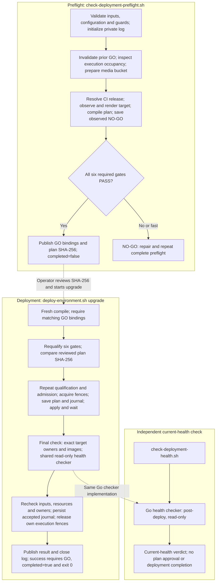

# V2 Deployment Script Flow

Status: draft implementation reference; requires the separately delivered v2 engine.

Owner: `rtk_cloud_workspace`.

Last reviewed: 2026-10-09.

Applies to: the local v2 existing-environment update implementation reviewed on
2026-10-09, based on workspace commit `c68f042ecacbf3b3a7250b87e17676a1ca937233`
plus its uncommitted deployment changes.

The reviewed engine is not present in remote `main` at the PR base
`9ba108e1`. This documentation-only change preserves its flow chart and completion
boundaries for review without publishing the pending code. Use the
[Deployment Operations Guide](deployment-operations.md) for the currently
published implementation. Reconcile this reference with the final v2 code before
promoting it to active operator instructions.

## Reviewed script flow

This is the reviewed local v2 implementation for a complete **existing-environment
upgrade**, using the default preflight operation and `deploy-environment.sh
upgrade`. Fresh bootstrap, Production activation, scoped `image-upgrade` and
business E2E/data acceptance have separate procedures. The workflow below does
not establish that any environment has passed its live checks.

| Entry | Dispatch and responsibility |
| --- | --- |
| [`check-deployment-preflight.sh`](../scripts/check-deployment-preflight.sh) | Calls [`check-deployment-credentials.sh`](../scripts/check-deployment-credentials.sh) with fixed `pre-deploy`/read-only settings. `deployment check` dispatches the complete update to the shared v2 `preflight` CLI. Qualifies one exact plan and publishes GO/NO-GO evidence. |
| [`deploy-environment.sh upgrade`](../scripts/deploy-environment.sh) | Builds and runs the native `deployment upgrade` CLI. Recompiles and requalifies the approved target, executes its resources, and runs mandatory final verification and health acceptance before reporting completion. |
| [`check-deployment-health.sh`](../scripts/check-deployment-health.sh) | Uses the common check wrapper with fixed `post-deploy`/read-only settings. Checks the current environment independently; it does not approve a future plan or finish an earlier deployment. |

The **final check is inside deployment**. The executor first verifies the exact
target workload owners and images, then `acceptEnvironmentRollout` directly
calls the maintained Go health checker with `--phase post-deploy --read-only`.
It does not launch `check-deployment-health.sh` as a child script. The standalone
health wrapper remains useful for later rechecks and diagnosis.

### Flow chart

Solid arrows show the successful execution path. Dotted arrows show the
operator's evidence handoff or shared implementation, not automatic shell
invocations. Required failures stop the affected path; the failure behavior is
described below.

### Ordered checks and completion boundary

Preflight performs these steps:

1. Validate invocation, maintained configuration, report path and
   maintenance/recovery guards, then initialize the private progress log.
2. Replace earlier GO bindings with NO-GO before new checks. Inspect the local
   `deployment/.execution-active` fence, then the selected cluster Lease.
   Occupied or unreadable state stops before storage preparation and compilation.
3. Verify the configured media bucket. When
   `RUNTIME_MEDIA_STORAGE_CUTOVER_REQUIRED=false`, confirmed absence permits
   creation of that exact bucket and requires fresh inventory readback.
4. Resolve exact-source formal CI images, observe selected live owners and
   identity references, render the maintained target and compile the v2 plan in
   memory. Save compiled observations as NO-GO bindings.
5. Run the six required gates in order: `deployment.target`,
   `deployment.release`, `deployment.execution`, `deployment.pki`,
   `deployment.compatibility`, `deployment.network`. Only complete PASS evidence
   permits GO bindings; `--fast` remains NO-GO. Report the plan SHA-256, with
   `completed=false` because preflight has not deployed anything.

Deployment repeats input validation, also requiring `--confirm` and the reviewed
`--plan-sha256`. It freshly compiles the same target and requires matching private
GO bindings, runs the six gates, then compares the requested plan digest.
`Plan.Execute` repeats qualification and whole-plan admission before acquiring
the cluster Lease and local execution locks and saving the full plan and initial
journal. Resource writes and waits follow phase/dependency order. Each phase
has fresh input/resource fences; each write has fresh owner/baseline checks and
exact-body admission.

After the resource loop, completion requires resource verification, exact
target owner/image checks, the read-only health checker, another input fence and
resource verification, final UID/Lease ownership checks, and the accepted
journal. The executor must then release its own cluster Lease and archive its
local execution fence before the CLI can report `completed=true`. The integrated
health checker covers current credentials and Secret mirrors, workloads, live
PKI, configured provider reads and required public CertIssuer mTLS. Full feature,
business-flow and data acceptance remain separately invoked tests.

A failed, cancelled or timed-out execution still attempts ownership-checked
cleanup under a fresh bounded context. Cleanup failure is NO-GO and retains
unreleased evidence for inspection. Partial writes or failed health acceptance
remain incomplete even when cleanup succeeds; there is no automatic rollback
or journal continuation. Inspect the journal, resolve the actual failure and
repeat complete preflight for a newly reviewed plan.

Invalid invocation, configuration, guard or log initialization can fail before
old GO invalidation. GO bindings are published before the optional report, and
logs close last; report/log publication failures still fail the command. Check
the exit status together with the final verdict rather than treating a stored
GO record or an accepted journal as proof that the entire command succeeded.

Preflight's optional report uses `rtk-cloud.deployment-report/v2` with a sanitized
plan summary (`schema_version: 2`); it does not save the full execution plan.
Generated bindings use `rtk-cloud.preflight-bindings/v1` at
`deployment/identity-bindings.json`. Execution saves the full `plan.json` and
`journal.json` under `deployment/rollback/<plan-sha256>/`. All these paths are
beneath `~/.config/rtk_cloud/<environment>/`, with 0700 directories and 0600 files;
see [artifact paths](deployment-secrets-governance.md#configuration-versus-deployment-generated-data).

## Implementation references and promotion

The reviewed local implementation is organized as follows. The v2 CLI and
executor paths are pending implementation inputs, not source files supplied by
this documentation-only PR.

| Source path | Responsibility |
| --- | --- |
| `scripts/go/rtk-cloud/deployment_check.go` (`runDeploymentCheckWithDependencies`) | Phase dispatch into the v2 preflight or current-health checker. |
| `scripts/go/rtk-cloud/deployment_unified_cli.go` (`runUnifiedEnvironmentDeploymentWithDependencies`, `acceptEnvironmentRollout`) | Qualification, bindings/report publication and integrated final health checks. |
| `scripts/go/rtk-cloud/internal/deploymentplan/execute.go` (`Plan.Execute`) | Admission, ordered writes/waits, final verification, journals and execution-fence cleanup. |

Before promoting this reference to active operator guidance, merge the v2
implementation separately, compare its final code with every stage above, verify
all source paths/symbols and rerun the applicable documentation checks. Live GO
and deployment completion still require checks against the selected environment
and exact release.
