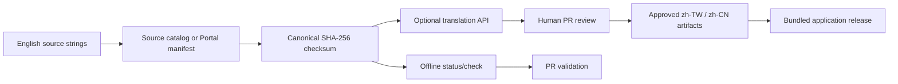

# Portal 與 Admin 多語系設計

## 目的與範圍

English (`en`) 是 Portal 與 Admin Console 的唯一來源語言。`zh-TW` 與 `zh-CN` 是隨版本發布、可在 Git 中審核的語言成品。頁面渲染不會等待翻譯 API，也不會把使用者資料或執行期內容交給翻譯服務。

本設計涵蓋可見 UI、導覽、頁面標題、SEO 摘要與可管理的產品字串。長篇文件、行銷內容、email、匯出檔與 API payload 保有各自的作者審核流程；若日後納入，必須先定義來源、敏感度與審核者。

目前已交付的基礎包括：

- Admin Console 的 `en`、`zh-TW`、`zh-CN` locale 選擇、瀏覽器偏好保存與 locale-aware 數字、日期、貨幣格式。
- Admin 的英文來源 catalog、繁體與簡體核准翻譯、checksum 驗證與 PR gate。
- Portal 的英文 UI、頁面 title 與 description source manifest；既有 Portal Catalog 人工翻譯繼續作為核准來源。
- 共用的 draft 產生工具；只有明確帶入 API key 的本機工作才會呼叫翻譯提供者。

## 架構



Admin 的 runtime 資源位於 `repos/rtk_cloud_admin/web/src/i18n/`。發布治理 artifact 位於獨立的 `repos/rtk_cloud_admin/web/localization/` JSON 檔；兩者分離後，CI 可以拒絕過期翻譯，而 build 不需要翻譯 API。

Portal 透過 `repos/rtk_cloud_frontend/cmd/localization-catalog` 匯出 manifest。它使用與共用 Node 工具相同的 canonical checksum 欄位順序，因此未來 Portal artifact consumer 可重用同一個 cache 與審核流程。

## 資料契約與失效規則

每個來源字串都有 `key`、英文 `source`、`context` 與 `placeholders`。checksum 是這四個欄位依固定 JSON 欄位順序計算的 SHA-256 值。翻譯結果另保存 `sourceHash`、文字與狀態；draft 也會保存與 locale、policy version 綁定的 fingerprint。

任何英文文字、context 或 placeholder 的修改都會使該筆翻譯失效，但不會影響無關字串。CI 的 `check` 必須拒絕下列狀況：

- 缺少目標 locale 的字串。
- 翻譯的 source checksum 已過期。
- placeholder 遺失、增加或改名。
- 狀態仍是 `draft`，或 artifact 格式不正確。

`context` 不得只寫技術位置；它應說明產品意義，例如「刪除裝置確認按鈕」或「帳單未付款提示」，以降低同字異義的錯譯。

## 翻譯生命週期

1. 開發者先加入或修改英文來源，為每個可翻譯字串設定穩定 key、context 與 placeholders。
2. 執行 `status` 找出 missing 或 stale 項目。
3. 若需要草稿，在受控本機環境執行 `translate`。工具只傳送 catalog 的英文字串、context、placeholder 與 glossary，並以 `store: false` 呼叫 provider。
4. 翻譯工具將結果寫為 `draft`，絕不自行提升為 `approved`。
5. 產品或語言審核者在 PR 檢查術語、語氣、數值與參數、破壞性操作、帳務、權限與同意文案後，才將狀態改為 `approved`。
6. PR CI 離線驗證 artifact；通過後，翻譯和程式碼一起隨 release 發布。

這是 release-time cache，不是 runtime cache：checksum 是快取鍵，Git artifact 是快取值與審核紀錄。這使服務暫時不可用、API 限流或費用變動時不影響使用者開啟頁面。

## 指令

檢查已核准的 Admin catalog：

```sh
node tools/localization/localization.mjs check \
  --catalog repos/rtk_cloud_admin/web/localization/catalog.json \
  --translations repos/rtk_cloud_admin/web/localization/translations
```

產生缺少或 checksum 過期的繁中草稿：

```sh
OPENAI_API_KEY=... node tools/localization/localization.mjs translate \
  --catalog repos/rtk_cloud_admin/web/localization/catalog.json \
  --translations repos/rtk_cloud_admin/web/localization/translations \
  --locale zh-TW
```

匯出 Portal 英文來源：

```sh
(cd repos/rtk_cloud_frontend && GOWORK=off go run ./cmd/localization-catalog)
```

一般 PR CI 不得執行 `translate`，也不得配置翻譯 API credential。

## UI 與 fallback 規則

應用程式以明確選取的 locale 優先，接著使用受支援的瀏覽器 locale，最後回退至 `en`。Admin 將使用者偏好保存於 `rtk-console-locale`，並在切換後以 i18n language change 重新渲染。所有數字、日期與貨幣格式都必須讀取目前 locale；不得把 `en-US` 固定寫進產品程式碼。

新的可見 UI 字串應從受管理資源讀取。尚未遷移的歷史字串繼續顯示英文，直到被加入 catalog 並有核准翻譯；不得以臨時機器翻譯覆蓋它們。

## Glossary、品質與責任

catalog 的 glossary 是跨語言產品術語的權威輸入，例如 `Brand Cloud` 與 `OTA`。新增品牌名、角色名、產品名或不應翻譯的縮寫時，必須同 PR 更新 glossary。翻譯審核者負責語言正確性與產品語意；程式審核者負責 key 穩定性、placeholder、checksum 與 runtime 顯示。

翻譯 API 是草稿協助工具，不是權威來源。它不得取得客戶資料、帳號識別、裝置遙測、API response、log、token、secret 或未公開文件。若日後更換供應商，必須保留相同 draft-only、無 runtime 呼叫與人工核准規則。

## 擴充與維護流程

每次遷移一個 Admin 或 Portal surface 時：

1. 先把英文文案集中為穩定 key，並新增使用 locale 格式化的測試。
2. 加入來源 manifest/catalog，填寫 context 與 placeholders。
3. 產生 draft、完成術語審核，將兩種中文標為 approved。
4. 更新 unit inventory 與其產生文件；新增測試未登錄時，coverage inventory gate 會拒絕 PR。
5. 執行 localization check、受影響應用程式測試與建置，再讓 PR CI 驗證。

新 locale 的導入需同時擴充 runtime locale 清單、catalog 目標清單、翻譯 artifact、字型與視覺 QA。不得假設所有語言的文字長度、日期格式或複數規則相同。

## 維運證據

`Localization validation` workflow 會在變更共用工具、Admin catalog、翻譯 artifact 或 submodule 指標的 PR 上執行離線單元測試與完整核准檢查。`Go Coverage Governance` 同時驗證新增 Admin i18n 測試已列入 unit inventory。這兩個 gate 共同保證翻譯產物可發布且測試可追溯。
